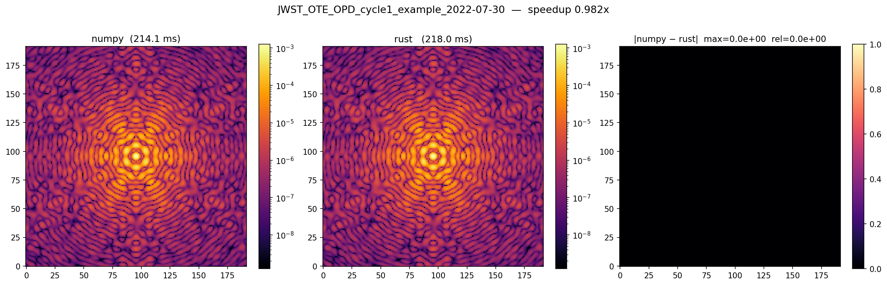
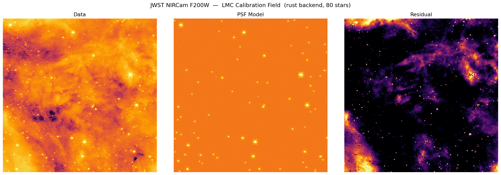
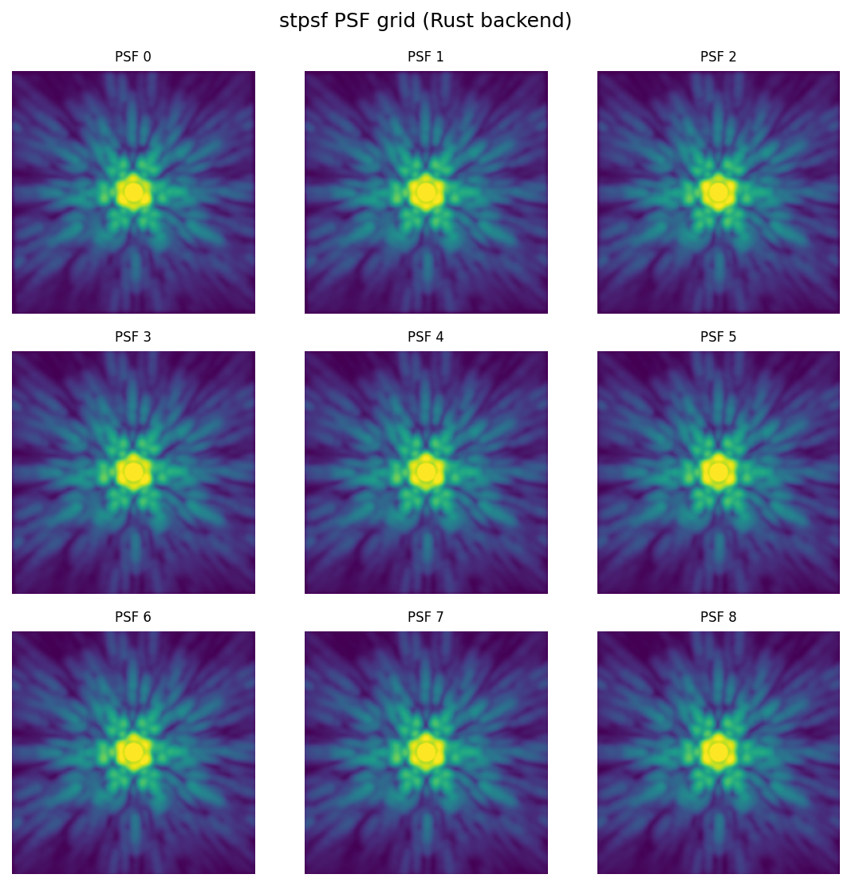

# poppy-rs

A Rust-accelerated backend for [poppy](https://github.com/spacetelescope/poppy), the
physical optics propagation library used by JWST's PSF simulation tools
([stpsf](https://github.com/spacetelescope/stpsf)).

Replaces poppy's two FFT hot-path primitives with parallel, in-place Rust
implementations that eliminate Python's temporary-array allocation problem and
saturate available CPU cores — **no changes to calling code required**.

---

## What it does

A JWST PSF simulation repeatedly calls two functions per wavelength: a 2D FFT
to propagate the wavefront between optical planes, and a matrix DFT to resample
it onto the detector. The Python/numpy path allocates multiple full-sized
intermediate arrays on every call (up to ~800 MB/wavelength for coronagraphic modes),
causing system OOM crashes on modest hardware when simulating broadband PSFs.

This library provides compiled replacements for both functions that:

- Operate **in-place on a single working buffer** — no temporary allocation spikes
- **Parallelize across CPU cores** via rayon (row FFTs, column FFTs, and exp matrix
  construction all run in parallel)
- Are **bit-accurate** with the numpy path (max diff < 1×10⁻¹⁶ in full integration tests)

See [`docs/PROBLEM.md`](docs/PROBLEM.md), [`docs/SOLUTION.md`](docs/SOLUTION.md), and
[`docs/IMPLEMENTATION.md`](docs/IMPLEMENTATION.md) for full details.

---

## Performance

Integration tests using a real JWST on-orbit OPD (Cycle 1, 2022-07-30) through
stpsf's full `calc_psf()` pipeline:

| Instrument / Filter | numpy | Rust | Speedup |
|---|---|---|---|
| NIRCam F200W (21 wl) | 5499 ms | 2188 ms | **2.51×** |
| NIRCam F444W (9 wl)  | 1974 ms | 1364 ms | **1.45×** |
| MIRI F560W   (9 wl)  | 2414 ms | 1966 ms | **1.23×** |

Gains scale with the number of wavelength samples — wide filters with many samples
(F200W: 21 wl) benefit most from the parallelism.

### NIRCam F200W — numpy vs Rust, real JWST OPD



*Left: numpy backend. Centre: Rust backend. Right: |numpy − Rust| (pixel-exact, max diff = 0).*

---

## Applied to real data: Tarantula Nebula (30 Doradus)

PSF forward-model of a JWST NIRCam F200W observation of 30 Doradus (program 2729,
NRCA1, June 2022) — one of the most active star-forming regions in the Local Group.



*Left: raw 512×512 px NIRCam cutout. Centre: PSF model (80 detected stars, Rust backend).
Right: residuals — the model cleanly separates point sources from the diffuse nebular emission.*

### PSF grid across NRCA1 detector



*3×3 grid of theoretical PSFs at nine positions across the NRCA1 detector.
Field-dependent aberrations from JWST's mirror geometry are visible in the subtle
shape variation across the grid.*

---

## Install

```bash
pip install maturin
git clone https://github.com/trdougherty/poppy-rs
cd poppy-rs
maturin develop --release
```

Requires Rust ≥ 1.85, Python ≥ 3.9.

To activate in poppy:

```python
import poppy
poppy.conf.use_rust = True
poppy.accel_math.update_math_settings()
```

The poppy-side change is a 7-line patch to `matrixDFT.py`
(see [`patches/matrixDFT_rust_dispatch.patch`](patches/matrixDFT_rust_dispatch.patch)).

---

## Repository layout

```
src/lib.rs                    Rust implementation (fft_2d, matrix_dft)
tests/compare.py              Unit-level correctness + timing vs poppy numpy
tests/integration_test.py     End-to-end test through stpsf with real OPD + filters
scripts/compare_engines.py    Per-file OPD benchmark with output images
scripts/rebuild_star_field.py PSF forward-model a real JWST image
scripts/view_fits.py          Visualize stpsf FITS data files
docs/PROBLEM.md               Root cause analysis
docs/SOLUTION.md              Why Rust fixes it
docs/IMPLEMENTATION.md        .so build, buffer passing, GIL release
patches/                      Patch files for the upstream poppy PR
```
